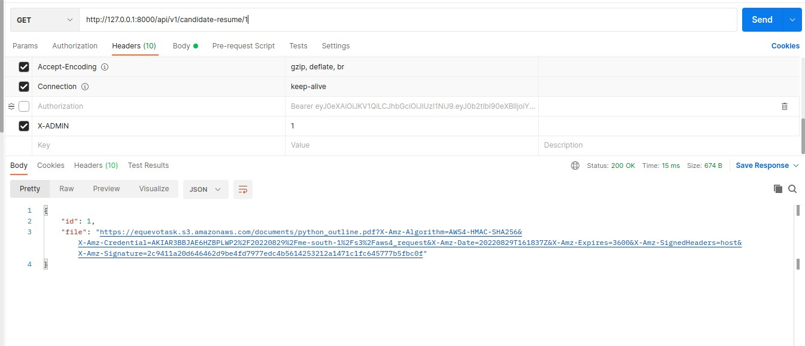

# API Guide
This guide is a documentation for equevo hr project API's.

## API's:
Base url : http://127.0.0.1:8000/api/v1

| endpoint     | Description | method |
| ------------- | ----------- | ----------- |
| /register-candidate | Endpoint that allows a      candidate to regiter their information and upload their resume       | POST

request body example :

fields :
| Key | Value type|
| ------------- | ----------- |
| resume | file (.docx, .pdf)
| full_name | String
| date_of_birth | date (YYYY-MM-DD)
| years_of_experience | positive integer
| department | numeric string, options are: (1 --> IT, 2 --> HR, 3 --> Finance) 

response example :

| endpoint     | Description | method |
| ------------- | ----------- | ----------- |
| /list-candidates | Admin access only endpoint to list candidates       | GET

Note: Send "X-ADMIN" header in the request with a value of "1"

request and response body example :

| endpoint     | Description | method |
| ------------- | ----------- | ----------- |
| /candidate-resume/:candidate-id | Admin access only endpoint to list candidates       | GET

Note: 
- Send "X-ADMIN" header in the request with a value of "1"
- Query argument: numeric string candidate id

request and response body example :

